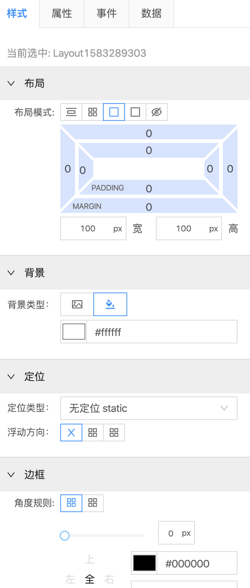

<!--
 * @abstract: JianJie
 * @version: 0.0.1
 * @Author: bhabgs
 * @Date: 2020-03-04 10:05:41
 * @LastEditors: bhabgs
 * @LastEditTime: 2020-03-04 11:03:47
 -->

# 样式配置 使用文档

> malyan 中，支持组件内联样式 style 属性可视化配置，拥有 可视化配置 和 代码配置 两种配置方式。

## 可视化配置

> 可视化方式控制当前选中组件自身的样式，将布局、文字、定位、背景、边框五类样式枚举并可视化表现出来，适合不同角色用户使用。

> 

## 问题

> 1. - [x] 边框 在处在回显时 会出发死递归
> 2. - [ ] 边框 出处在回显时 border-radius 处会出现细微 bug
> 3. - [ ] 在拖拽新组建进入 画布区域时， 会带着 上次编辑的样式进入新组建

## 优化

> 1. - [ ] 数据结构优化
> 2. - [ ] 数据传递脏查询优化
